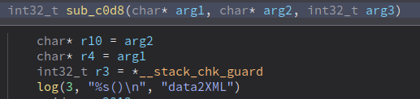
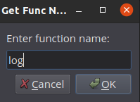
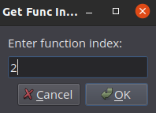
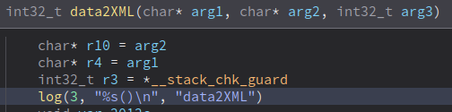

# log2func
Author: **biazo**

_Uses log function's parameter to name corresponding_

## Description:

When you have a log function, you can use it to create a function that corresponds to the log function parameter.

# Example

1. Identitfy the log function that passes function name as its parameter
2. give the function a name
3. give the function a parameter index

Alot of times when you are reversing a firmware, they use a log function with function name as its parameter.
For this example below, it passes function name to a log function as second index (0 indexed).

## Minimum Version

3481

## License

This plugin is released under an [MIT license](./LICENSE).

## Metadata Version

2